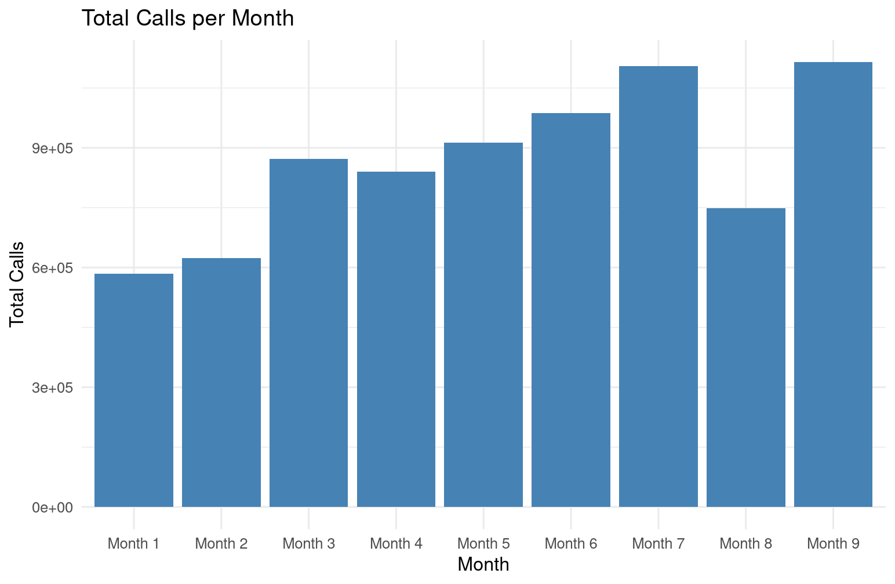

# Preliminary Observations

## Dataset

Let's first briefly analyze the dataset.
- **For each user:**
  - Plan type
  - Payment method
  - Sex
  - Activation zone
  - Activation channel
  - value added service 1
  - value added service 2
  - **For each month:**
    - $|expensive calls|$
    - $|cheap calls|$
    - $time(expensive calls)$
    - $time(cheap calls)$
    - $cost(expensive calls)$
    - $cost(cheap calls)$
    - $|incoming calls|$
    - $time(incoming calls)$
    - $|SMS|$
    - $|calls to call center|$

Considering that the target is *monthly call time* we can make the hypothesis that some features do not interest us, specifically: *value added service 1* and *2*, any monthly feature not concerning with call time itself, leaving us with only $time(expensive calls)$ and $time(cheap calls)$, which we could further assume can be summed between each other since overall cost is not a concern. Moreover, there is the possibility that any feature other than time can be discarded. It goes without saying that all of the above should be proved empirically.

### Calls Over Everything

Let's try to see if the amount and time of calls are related to other features (for example sex) or not.
First we want to see the total calls taken and the total call time over nine months. All the test are done on the training set to prevent data leakage.


|[](./monthly_calltime.png)

It is very interesting to see that the two graphs, while differing greatly in Y-values magnitude, are almost identical from a trend standpoint, hinting at a strong correlation between number of calls and time spent calling. If proven (for example with a correlation matrix), and considering our target, the amount of calls per month can probably be dropped.

Then we would like to know if gender plays any role at all in estimating the total call time. Using library *dplyr* we can compute the following table.

```{bash}
  sex   n_customers total_call_time avg_call_time
  <chr>       <int>           <dbl>         <dbl>
1 B            5266       557266412       105823.
2 F            1030        62493290        60673.
3 M            3704       242226228        65396.
```

On average, with our data, men's calls seem to last 8% longer. We should ask ourselves if this is a significant behaviour of if its significance is hindered by some outliers. We can try to mitigate their effect by filtering out the top 1%.

```{bash}
  sex   n_customers total_call_time avg_call_time
  <chr>       <int>           <dbl>         <dbl>
1 B            5201       498846876        95914.
2 F            1025        57203392        55808.
3 M            3674       215801665        58738.
```

Once again, we see that man's calls seems to last roughly5% longer than women's.
Let's try to be more aggressive and cut off the top 10%.

```{bash}
  sex   n_customers total_call_time avg_call_time
  <chr>       <int>           <dbl>         <dbl>
1 B            4595       276063673        60079.
2 F             960        32400501        33751.
3 M            3445       130747836        37953.
```

Here we see an even higher 10% increase in call time fro men.
Lastly, we could try to reduce the impact of outliers by compressing the data logarithmically instead than cutting off the top 1%. 

```{bash}
  sex   n_customers total_call_time avg_log_call_time
  <chr>       <int>           <dbl>             <dbl>
1 B            5266       557266412             10.0 
2 F            1030        62493290              8.24
3 M            3704       242226228              8.58
```

We still see an increase in call times for men even on compressed values. We can conclude that, for our customers, men tend to call for longer. 

We can do something similar for plan and paying method. We will cut off the top 1%.

```{bash}
  tariff.plan n_customers total_call_time avg_call_time
        <int>       <int>           <dbl>         <dbl>
1           3         781        44811041        57376.
2           4          83        10575009       127410.
3           6         724        92214268       127368.
4           7        3564       489635465       137384.
5           8        4748       134616150        28352.
```

```{bash}
  payment.method          n_customers total_call_time avg_call_time
  <chr>                         <int>           <dbl>         <dbl>
1 Bollettino Postale             1555       145651774        93667.
2 Carta di Credito               4747       332659385        70078.
3 Domiciliazione Bancaria        3598       293540774        81584.
```

There seem to be quite a bit of variance in call times compared to the tariff plan, which would make sense: some plans may be geared toward calling, while others are more suited for someone that sends a lot of SMS. We can see some variance on payment method too, even tho one would expect an automatic one (e.g., card) to incentivize higher phone usage. With our data this does not seem to be the case (at least as far as call times are concerned).

Lastly, lets see if there seem to be some difference in call times between activation zones, channels and wether having first o second value-added services have any relevance at all.

```{bash}
  activation.zone n_customers total_call_time avg_call_time
            <int>       <int>           <dbl>         <dbl>
1               1        3507       288670845        82313.
2               2        3130       213438509        68191.
3               3        2342       197941555        84518.
4               4         921        71801024        77960.
```

```{bash}
  activation.channel n_customers total_call_time avg_call_time
               <int>       <int>           <dbl>         <dbl>
1                  2         130        10643060        81870.
2                  3         408        36663577        89862.
3                  4          31         2369822        76446.
4                  5        7135       623961079        87451.
5                  6          47         4352853        92614.
6                  7         652        62777153        96284.
7                  8         111        12074180       108776.
8                  9        1386        19010209        13716.
```

```{bash}
  vas1  n_customers total_call_time avg_call_time
  <chr>       <int>           <dbl>         <dbl>
1 N            7450       526620961        70687.
2 Y            2450       245230972       100094.
```

```{bash}
  vas2  n_customers total_call_time avg_call_time
  <chr>       <int>           <dbl>         <dbl>
1 N            9279       695404226        74944.
2 Y             621        76447707       123104.
```

Activation zone and channel seem to have some influence on call times, with the exception of zone eight, whose call times are way lower. On the other hand, customers that have activated either first or second added-value services clearly call for longer.

### Monthly Call Time Skewness

Call time data is usually positively skewed, with many users having low usage and a small number of user with very high usage (e.g.,50.000 seconds).
This is easily verifiable at a glance if we try to plot the monthly call time or, better yet, with an histogram.


A common method to compress such data is by applying a logarithmic function to it.


# Prediction

## Linear Regression

### Heteroskedasticity

One preliminary way to check whether there is some form of heteroskedasticity is by computing a residual plot.

```{r}
fit <- lm(y ~ ., data = train)

plot(fitted(fit), resid(fit),
     xlab = "Fitted values",
     ylab = "Residuals",
     main = "Residuals vs Fitted")
abline(h = 0, lty = 2)
```

As we can see there is a evident funnel shape, often sign of heteroskedasticity. To prove it more formally we can check p-values.

```{r}
library(lmtest)
bptest(fit)
```

## KNN

Let's start with a baseline prediction using a simple KNN model for regression. I first tried to fit all the data, without logarithmically transform the target, but I had to change the validation method from Leave-One-Out-Cross-Validation to just Cross-Validation for lack of memory.

```{rbash}
k-Nearest Neighbors 

10000 samples
   98 predictor

Pre-processing: centered (100), scaled (100) 
Resampling: Cross-Validated (10 fold) 
Summary of sample sizes: 8999, 9000, 9001, 9000, 8999, 8999, ... 
Resampling results across tuning parameters:

  k   RMSE      Rsquared   MAE     
   1  4510.530  0.4594312  1258.249
      ........  ........   ........
   8  4045.793  0.5674593  1123.891
      ........  ........   ........
  20  4140.494  0.5695263  1132.276

RMSE was used to select the optimal model using the smallest value.
The final value used for the model was k = 8.
```

It is quite evident that $MSE = 16368440.9988$ is a terrible result. I then tried to train the model on target $log(y+1)$ and got much better results: with $k=15$, $RMSE=2.367258$ and $MSE=5.60391043856$. Thus I predicted *yhat* as follows.

```{r}
yhat <- exp(predict(knn_fit, newdata=phone_test)-1)
```