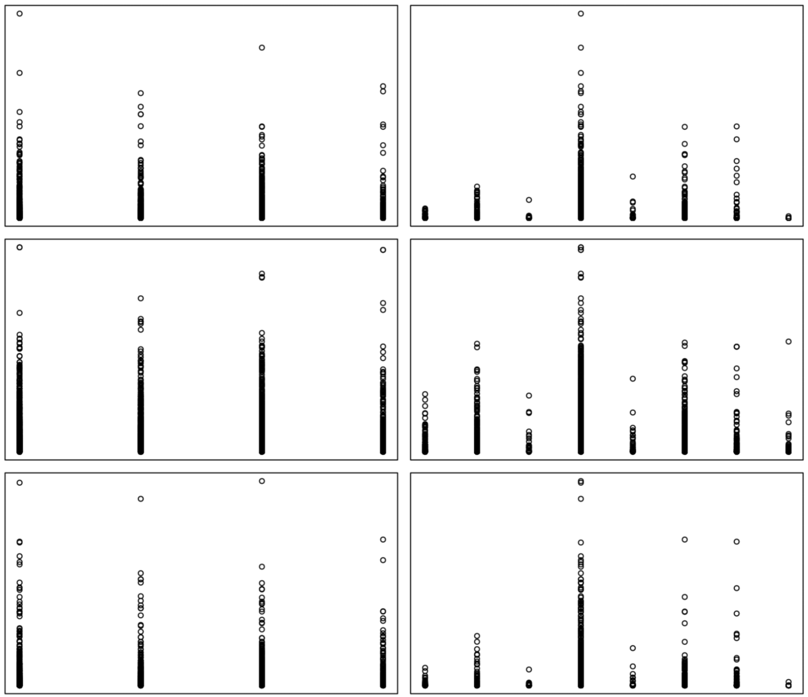
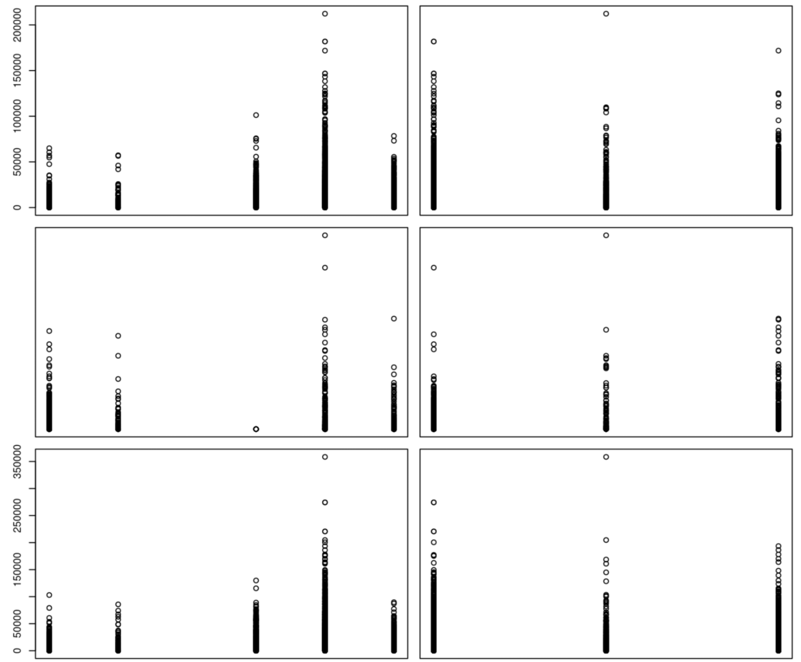
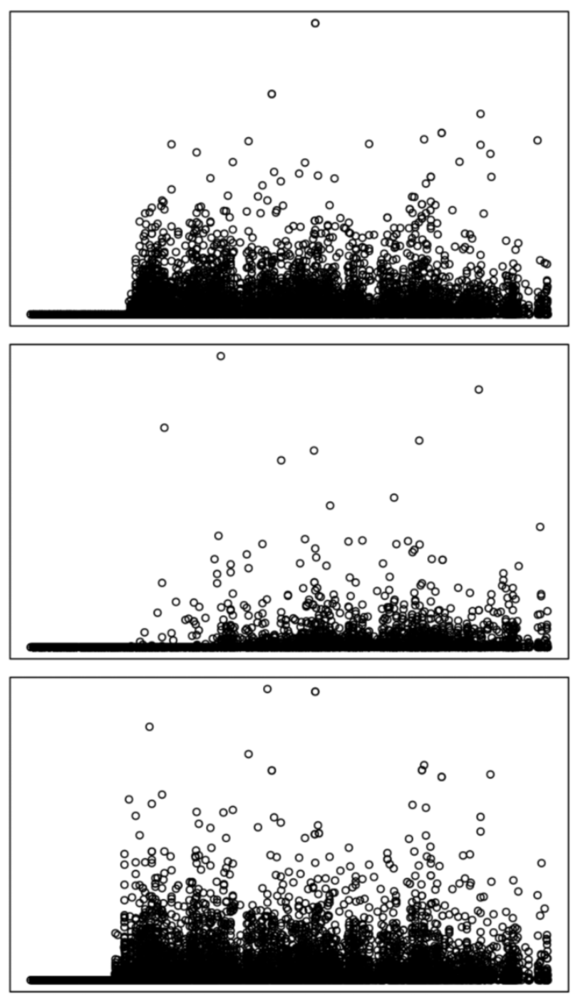
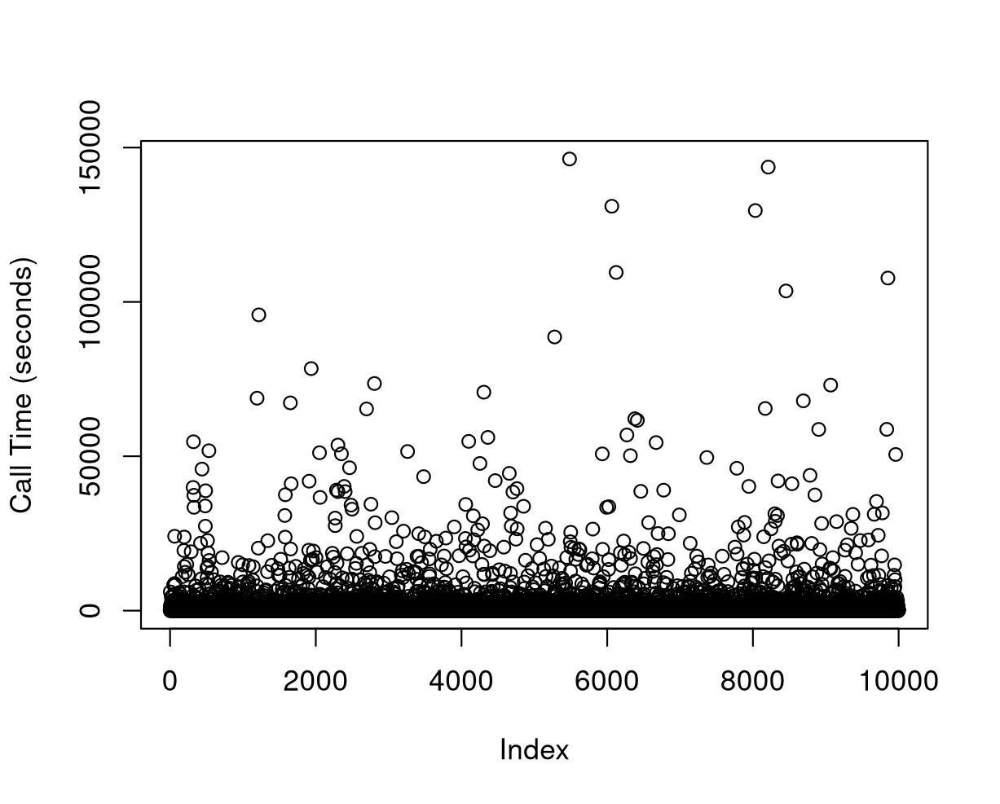
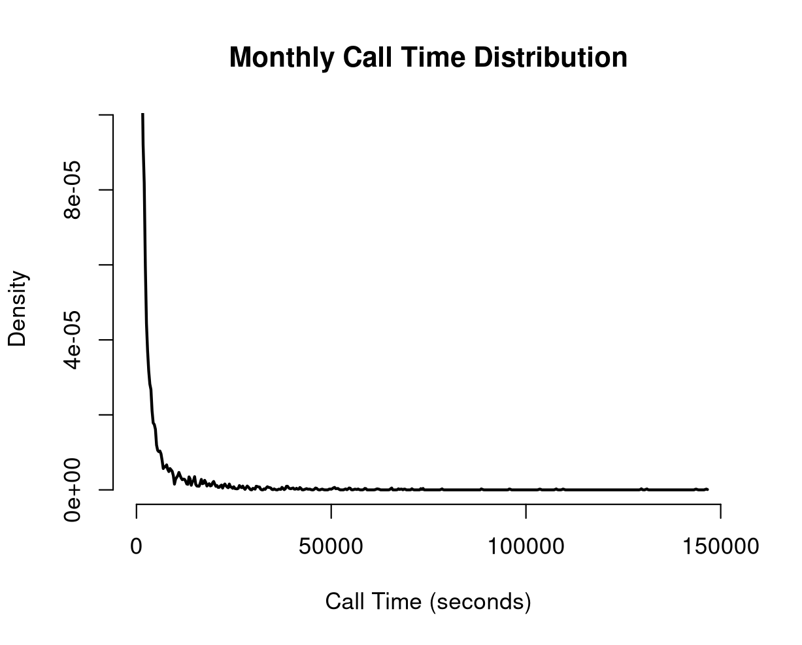
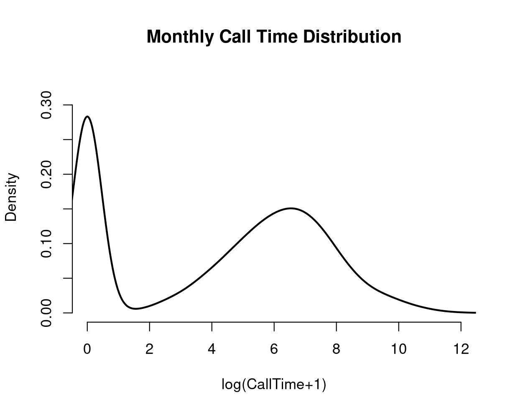
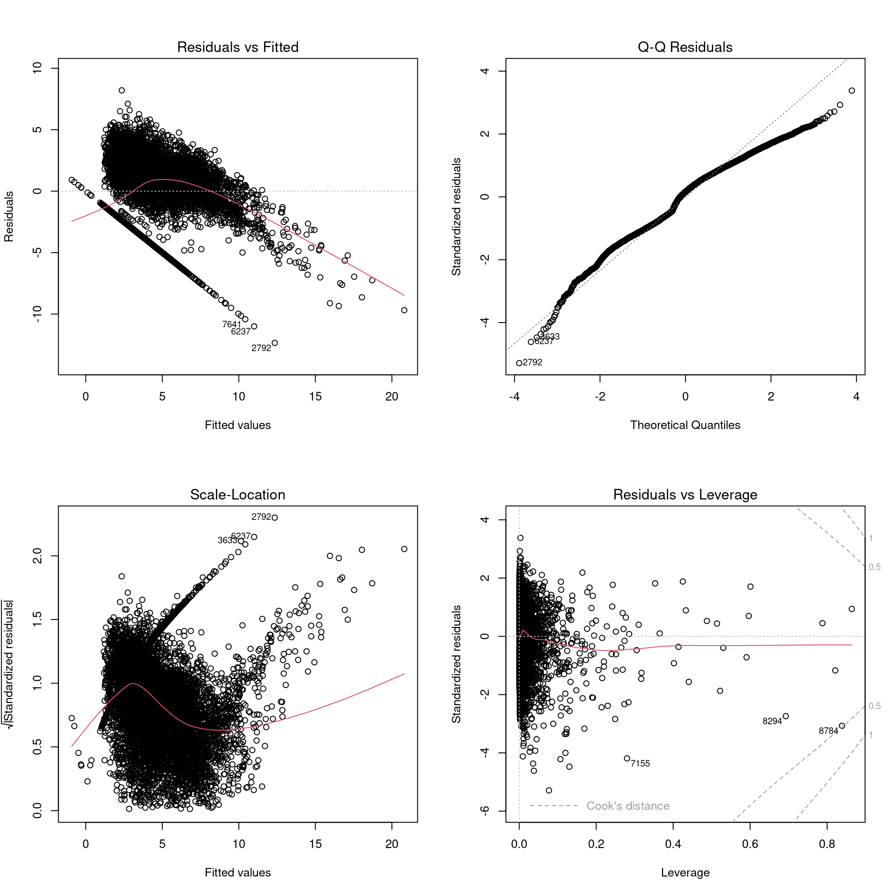

# Preliminary Observations

## Dataset

Let's first briefly analyze the dataset.
- **For each user:**
  - Plan type
  - Payment method
  - Sex
  - Activation zone
  - Activation channel
  - value added service 1
  - value added service 2
  - **For each month:**
    - $|expensive calls|$
    - $|cheap calls|$
    - $time(expensive calls)$
    - $time(cheap calls)$
    - $cost(expensive calls)$
    - $cost(cheap calls)$
    - $|incoming calls|$
    - $time(incoming calls)$
    - $|SMS|$
    - $|calls to call center|$

Considering that the target is *monthly call time* we can make the hypothesis that some features do not interest us, specifically: *value added service 1* and *2*, any monthly feature not concerning with call time itself, leaving us with only $time(expensive calls)$ and $time(cheap calls)$, which we could further assume can be combined since overall cost is not a concern. It goes without saying that all of the above will have to be be proven empirically.


## Scatterplot

```{r}
library(dplyr)
library(ggplot2)
library(tidyr)

df_filtered <- phone_train %>% 
    select(-matches("\\.out\\.ch")) %>%
    select(-matches("\\.out\\.val")) %>%
    select(-matches("\\.in")) %>%
    select(-matches("\\.sms")) %>%
    select(-matches("\\.cc")) %>%
    select(-matches("\\y")) 

plot(df_filtered)
```

I filtered out all monthly data not about call duration.
 The result is a bit hard to read due to its sheer size.


Looking at it more up close we can infer some things. First of all we see that call data looks positively skewed.


We can also see that there are some activation channels that see more call time than others, while activation regions seem to differ lightly between one another. 
X-axis: activation zone (L), activation channel (R)
Y-axis: call times



Tariff plan and sex seems to have an impact on call times too.
X-axis: tariff plan (L), sex (R)
Y-axis: call times



Lastly, age does not seem to have that big of an impact on call times, with the exception of the very old.
X-axis: age
Y-axis: call times




### Calls Over Everything

Let's try to see if the amount and time of calls are related to other features (for example sex) or not.
First we want to see the total calls taken and the total call time over nine months. All the test are done on the training set to prevent data leakage.


|[](./imgs/monthly_calltime.png)

It is very interesting to see that the two graphs, while differing greatly in Y-values magnitude, are almost identical from a trend standpoint, hinting at a strong correlation between number of calls and time spent calling. If proven (for example with a correlation matrix), and considering our target, the amount of calls per month can probably be dropped.

Then we would like to know if gender plays any role at all in estimating the total call time. Using library *dplyr* we can compute the following table.

```{bash}
  sex   n_customers total_call_time avg_call_time
  <chr>       <int>           <dbl>         <dbl>
1 B            5266       557266412       105823.
2 F            1030        62493290        60673.
3 M            3704       242226228        65396.
```

On average, with our data, men's calls seem to last 8% longer. We should ask ourselves if this is a significant behaviour of if its significance is hindered by some outliers. We can try to mitigate their effect by filtering out the top 1%.

```{bash}
  sex   n_customers total_call_time avg_call_time
  <chr>       <int>           <dbl>         <dbl>
1 B            5201       498846876        95914.
2 F            1025        57203392        55808.
3 M            3674       215801665        58738.
```

Once again, we see that man's calls seems to last roughly 5% longer than women's.
Let's try to be more aggressive and cut off the top 10%.

```{bash}
  sex   n_customers total_call_time avg_call_time
  <chr>       <int>           <dbl>         <dbl>
1 B            4595       276063673        60079.
2 F             960        32400501        33751.
3 M            3445       130747836        37953.
```

Here we see an even higher 10% increase in call time for men.
Lastly, we could try to reduce the impact of outliers by compressing the data logarithmically instead than cutting off the top 1%. 

```{bash}
  sex   n_customers total_call_time avg_log_call_time
  <chr>       <int>           <dbl>             <dbl>
1 B            5266       557266412             10.0 
2 F            1030        62493290              8.24
3 M            3704       242226228              8.58
```

We still see an increase in call times for men even on compressed values. We can conclude that, for our customers, men tend to call for longer. 
We can do something similar for plan and paying method. We will cut off the top 1%.

```{bash}
  tariff.plan n_customers total_call_time avg_call_time
        <int>       <int>           <dbl>         <dbl>
1           3         781        44811041        57376.
2           4          83        10575009       127410.
3           6         724        92214268       127368.
4           7        3564       489635465       137384.
5           8        4748       134616150        28352.
```

```{bash}
  payment.method          n_customers total_call_time avg_call_time
  <chr>                         <int>           <dbl>         <dbl>
1 Bollettino Postale             1555       145651774        93667.
2 Carta di Credito               4747       332659385        70078.
3 Domiciliazione Bancaria        3598       293540774        81584.
```

There seem to be quite a bit of variance in call times compared to the tariff plan, which would make sense: some plans may be geared toward calling, while others are more suited for someone that sends a lot of SMS. We can see some variance on payment method too, even tho one would expect an automatic one (e.g., card) to incentivize higher phone usage. With our data this does not seem to be the case (at least as far as call times are concerned).

Lastly, lets see if there seem to be some difference in call times between activation zones, channels and wether having first o second value-added services have any relevance at all.

```{bash}
  activation.zone n_customers total_call_time avg_call_time
            <int>       <int>           <dbl>         <dbl>
1               1        3507       288670845        82313.
2               2        3130       213438509        68191.
3               3        2342       197941555        84518.
4               4         921        71801024        77960.
```

```{bash}
  activation.channel n_customers total_call_time avg_call_time
               <int>       <int>           <dbl>         <dbl>
1                  2         130        10643060        81870.
2                  3         408        36663577        89862.
3                  4          31         2369822        76446.
4                  5        7135       623961079        87451.
5                  6          47         4352853        92614.
6                  7         652        62777153        96284.
7                  8         111        12074180       108776.
8                  9        1386        19010209        13716.
```

```{bash}
  vas1  n_customers total_call_time avg_call_time
  <chr>       <int>           <dbl>         <dbl>
1 N            7450       526620961        70687.
2 Y            2450       245230972       100094.
```

```{bash}
  vas2  n_customers total_call_time avg_call_time
  <chr>       <int>           <dbl>         <dbl>
1 N            9279       695404226        74944.
2 Y             621        76447707       123104.
```

Activation zone and channel seem to have some influence on call times, with the exception of zone eight, whose call times are way lower. On the other hand, customers that have activated either first or second added-value services clearly call for longer.

### Skewness

Call time data is usually positively skewed, with many users having low usage and a small number of user with very high usage (e.g.,50.000 seconds).
This is easily verifiable at a glance if we try to plot the monthly call time or, better yet, with an histogram.




A common method to compress such data is by applying a logarithmic function to it.



Let's now check wether other data exhibit similar characteristics by calculating the skewness with the *e1071* package.

```{bash}
        tariff.plan  activation.channel     q01.out.ch.peak    q01.out.dur.peak    q01.out.val.peak  q01.out.ch.offpeak 
          -2.026605            1.073333            4.930308            5.883900           10.158610           10.442799 
q01.out.dur.offpeak q01.out.val.offpeak       q01.in.ch.tot      q01.in.dur.tot          q01.ch.sms           q01.ch.cc 
           9.336163           31.977903            4.322467            3.615376           37.220847           12.493878 
    q02.out.ch.peak    q02.out.dur.peak    q02.out.val.peak  q02.out.ch.offpeak q02.out.dur.offpeak q02.out.val.offpeak 
           4.011558            5.026925            6.120357            9.636244            9.202850           23.789047 
      q02.in.ch.tot      q02.in.dur.tot          q02.ch.sms           q02.ch.cc     q03.out.ch.peak    q03.out.dur.peak 
           3.657302            3.444048           38.464828           10.697464            3.742071            4.194271 
   q03.out.val.peak  q03.out.ch.offpeak q03.out.dur.offpeak q03.out.val.offpeak       q03.in.ch.tot      q03.in.dur.tot 
           4.144170            8.709344            9.948054           25.074765            3.359255            3.280295 
         q03.ch.sms           q03.ch.cc     q04.out.ch.peak    q04.out.dur.peak    q04.out.val.peak  q04.out.ch.offpeak 
          35.231226           12.146903            3.726583            4.415209            3.988589            9.068477 
q04.out.dur.offpeak q04.out.val.offpeak       q04.in.ch.tot      q04.in.dur.tot          q04.ch.sms           q04.ch.cc 
          12.366396           10.517232            3.362859            3.660378           33.513288           12.284952 
    q05.out.ch.peak    q05.out.dur.peak    q05.out.val.peak  q05.out.ch.offpeak q05.out.dur.offpeak q05.out.val.offpeak 
           3.578910            4.056863            4.242749           12.129119           12.598793           11.390509 
      q05.in.ch.tot      q05.in.dur.tot          q05.ch.sms           q05.ch.cc     q06.out.ch.peak    q06.out.dur.peak 
           3.450009            3.165951           38.804264            9.085293            3.364608            4.622265 
   q06.out.val.peak  q06.out.ch.offpeak q06.out.dur.offpeak q06.out.val.offpeak       q06.in.ch.tot      q06.in.dur.tot 
           4.037063           15.035554           12.511158           10.149751            3.386507            3.621934 
         q06.ch.sms           q06.ch.cc     q07.out.ch.peak    q07.out.dur.peak    q07.out.val.peak  q07.out.ch.offpeak 
          28.668984           13.747535            3.157588            4.088846            3.830199           10.405367 
q07.out.dur.offpeak q07.out.val.offpeak       q07.in.ch.tot      q07.in.dur.tot          q07.ch.sms           q07.ch.cc 
          12.907377           10.128761            3.237636            3.192192           28.628610           16.762409 
    q08.out.ch.peak    q08.out.dur.peak    q08.out.val.peak  q08.out.ch.offpeak q08.out.dur.offpeak q08.out.val.offpeak 
           3.963771            4.131527            4.117853            9.256204           11.536043           11.204808 
      q08.in.ch.tot      q08.in.dur.tot          q08.ch.sms           q08.ch.cc     q09.out.ch.peak    q09.out.dur.peak 
           3.972012            3.953185           20.317293            8.946827            2.927636            3.781970 
   q09.out.val.peak  q09.out.ch.offpeak q09.out.dur.offpeak q09.out.val.offpeak       q09.in.ch.tot      q09.in.dur.tot 
           3.646469           10.344301           15.974234           11.674903            2.728376            3.152212 
         q09.ch.sms           q09.ch.cc                   y 
          16.048910           13.034136           10.820427 
```

We can ignore tariff plan and activation channel values since they are categorical features (already encoded into numerical ones). We can see that all monthly-based data (calls, call times, SMS, costs, etc) are highly positively skewed. To manage this problem we can either transform them (log, square root or Box-Cox transform), or use model less sensitive to this problematic (such as random forest, Gamma/Poisson or quantile regression). Methods like linear. ridge or lasso regression, and even some non-parametric ones like k-NN are, on the other hand, not ideal. 

## Correlation Matrix

Since *cor=(data)* takes only numerical values, we can use the *model.matrix* function. We do not need the target feature.

```{r}
x <- model.matrix( ~ ., phone_train)[, -1]
cor(x)
```

After a bit of processing we get the following:
1. Age is roughly correlated to all call-related monthly features (amount of call, call time, calls to call center, etc) by 20%. Some examples follow:
   - Month 9, number of outgoing calls off-peak to age correlation = 18%
   - Month 4, number of incoming calls total to age correlation = 30%
   - Month 1, time of outgoing calls off-peak to age correlation = 24%
   - Month 6, number of calls to call centers to age correlation  = 10%
2. First and second value-added services are correlated to some, not all, monthly features by roughly 10%
3. The only features that share significant correlation are all call-related monthly features, which is not at all surprising. Some example follow:
   -  Month 4, outgoing call time and call expenses correlation = 97%
   -  Month 3, outgoing call time and call expenses correlation = 87%
   -  Month 7, call expenses and outgoing call time correlation = 57%

One of the ways to handle collinearity is to either drop or merge the afflicted features, but in this specific situation I would rather not do the former since monthly call time is exactly what we aim to predict. On the other hand, predicting on the median monthly call time could yield good results.

## Linear Regression Insights

A good preliminary analysis can be done by plotting a linear regression fit.


What we can infer from the plots above is that our data presents high heteroskedasticity, skewness and in general that our data is not normally distributed. There are also potential outliers and influential points that could distort the model 8(for example point 9853).

Features that contribute strongly to the model are the following.

```{bash}
                                      t value Pr(>|t|)    
(Intercept)                            15.136  < 2e-16 ***
tariff.plan                           -23.320  < 2e-16 ***
payment.methodDomiciliazione Bancaria   2.029 0.042513 *  
age                                    -3.290 0.001004 ** 
activation.channel                      2.445 0.014485 *  
vas1Y                                   2.637 0.008389 ** 
q01.out.ch.peak                        -2.998 0.002725 ** 
q01.out.dur.offpeak                     3.006 0.002652 ** 
q01.out.val.offpeak                    -6.760 1.46e-11 ***
q03.out.val.peak                        3.534 0.000411 ***
q03.in.dur.tot                         -4.009 6.15e-05 ***
q04.out.dur.peak                       -3.183 0.001460 ** 
q04.out.val.peak                        2.320 0.020335 *  
q04.out.ch.offpeak                     -4.137 3.55e-05 ***
q05.out.ch.offpeak                      2.194 0.028282 *  
q05.out.dur.offpeak                    -2.375 0.017556 *  
q05.out.val.offpeak                     3.723 0.000198 ***
q05.in.ch.tot                          -3.401 0.000674 ***
q05.in.dur.tot                          2.231 0.025735 *  
q06.out.dur.peak                       -3.182 0.001469 ** 
q06.out.val.peak                        2.791 0.005260 ** 
q06.out.ch.offpeak                     -4.226 2.40e-05 ***
q06.out.val.offpeak                     4.772 1.85e-06 ***
q06.in.dur.tot                          2.642 0.008249 ** 
q07.out.dur.peak                        3.250 0.001160 ** 
q07.in.ch.tot                           4.881 1.07e-06 ***
q07.in.dur.tot                         -4.645 3.45e-06 ***
q08.out.ch.peak                         2.856 0.004293 ** 
q08.out.val.peak                       -4.434 9.33e-06 ***
q08.out.ch.offpeak                     -4.099 4.19e-05 ***
q08.out.dur.offpeak                     4.495 7.04e-06 ***
q08.out.val.offpeak                     2.112 0.034720 * 
q09.out.ch.peak                        -6.673 2.64e-11 ***
q09.out.dur.peak                       -0.825 0.409148    
q09.out.val.peak                       11.179  < 2e-16 ***
q09.out.ch.offpeak                     10.026  < 2e-16 ***
q09.out.dur.offpeak                    18.656  < 2e-16 ***
q09.out.val.offpeak                    -4.800 1.61e-06 ***
q09.ch.cc                              -2.097 0.036019 *  
```

We can see that, for the most part, relevant features are the one related to monthly calls. It is interesting to notice that the second month does not seem to hold much weight, even thought it presents a similar amount of call data compared to the first.

Log transforming the target yield better results, with a general normalization of the values, but we still see the same problems.



Here follows the features that contribute more to the prediction. It is interesting to see that this time around categorical values hold more weight.

```{bash}
                                      Pr(>|t|)    
(Intercept)                            < 2e-16 ***
tariff.plan                            < 2e-16 ***
payment.methodCarta di Credito        0.007256 ** 
payment.methodDomiciliazione Bancaria 0.001023 ** 
sexF                                  0.000623 ***
sexM                                  6.81e-09 ***
age                                    < 2e-16 ***
activation.channel                    4.42e-07 ***
vas1Y                                 2.43e-10 ***
q01.out.ch.peak                       0.004972 ** 
q01.in.dur.tot                        0.009498 ** 
q03.out.ch.peak                       0.016320 *   
q04.out.dur.peak                      0.002052 ** 
q04.out.val.peak                      0.012237 *  
q04.out.ch.offpeak                    0.031593 *  
q04.ch.cc                             0.036098 *   
q05.in.ch.tot                         0.041127 *  
q06.out.val.offpeak                   0.032902 *  
q07.out.dur.offpeak                   0.014165 *  
q07.out.val.offpeak                   0.004209 ** 
q08.out.ch.peak                       0.009375 ** 
q09.out.ch.peak                        < 2e-16 ***
q09.out.val.peak                      0.000828 ***
q09.out.ch.offpeak                    3.27e-08 ***
q09.in.ch.tot                         0.000294 ***
q09.ch.sms                            0.001544 ** 
```


## Principal Components

Data as-is can be transformed into 101 principal components, and the cumulative proportion with only two is approximately 0.45. To get to 99% of explained variance we need 69 components.


Once again we see sign of heteroskedasticity and other non-normal data distribution.

## Preliminary Observations Conclusions

First and foremost we want to filter out less useful data (for example SMS amount), then we either want to transform it (for example log or Box-Cox) and/or use some robust regression, like quantile or tree-based approaches.


# Prediction

## Lasso Regression

I will use lasso regression with Cross-Validation as a preliminary diagnostic tool for checking which features to drop or transform.
Let's first make a baseline prediction without transforming any value. The resulting fit mean square error is $MSE = 18091358$. Not great, but expected since we saw in the preliminary observations many signs of non-linearity.

I then tried log-transforming the target value (with all features).

```{r}
library(glmnet)
lasso_log_fit <- cv.glmnet(x[train, ], log(y[train]+1), alpha = 1)
lasso_log_fit_mse <- min(lasso_log_fit$cvm)
```

With this model we get $MSE = 6.200236$, which is way better than before, showing strong evidence that log-transforming the data is a good idea. 

Then, I filtered out incoming calls, SMS and calls to the call center, and fitted the model without log-transforming. We get $MSE = 18040253$, a 3% improvement over the model with all predictors. Keeping the calls to the call center, on the other hand, gives us a slightly worse $MSE = 18080968$.

```{r}
x_filtered <- x[, !grepl("\\.in|\\.sms|\\.cc$", colnames(x)), drop = FALSE]
```

Then, I filtered out some more monthly values, with these results:
- Amount and value of calls filtered out: $MSE = 18207357$
- Only value of calls filtered out: $MSE = 18067089$
- Only amount of calls filtered out: $MSE = 18118489$

We can infer that both value and amount of calls are useful for prediction and should be kept.

Then, I tried to remove non call related features (all of the following are with incoming calls, SMS and calls to call center filtered out):
- Baseline with only incoming calls, SMS and calls to call-center filtered out: $MSE = 18040253$
- No payment information: $MSE = 18035221$ 
- No payment, no sex information: $MSE = 18036839$ 
- No payment, sex, activation zone and channel information: $MSE = 18034269$
- No payment, sex, activation zone, channel and age information: $MSE = 18034610$
- No payment, sex, activation zone, channel, age and plan information: $MSE = 18975290$
- No payment, sex, activation zone, channel, age, plan information and presence of first or second added-value services : $MSE = 18969265$
- No payment, value-added services, activation channel and zone: $MSE = 18021270$ 
- No payment, No value-added services and activation zone: $MSE = 18022544$ 
- No payment, No value-added services and activation channel: $MSE = 18024845$ 
- No payment, value-added service one, activation zone and channel: $MSE = 18035228$
- No payment, value-added service two, activation zone and channel: $MSE = 18019454$ **(BEST)**

We can infer the following: call plan is very important in prediction precision. Sex, and age also seem to improve prediction precision.
On the other hand, dropping activation zone and channel seem to improve the model. Removing added-value service one yield worse performance, while removing the second one gives us an improvement. 

Overall, it would seem that the best model is with payment, second value-added service, activation channel, activation zone, incoming calls, SMS and calls to call center filtered out.

At this point I wanted to see whether some pre-processing on the monthly features could improve the prediction:
- Peak and offpeak values added together: $MSE = 32024591$ 
- Peak and offpeak values added together, prediction done on the average call time, number of calls and value over nine months: $MSE = 32174039$ 

It is quite evident that the best results are given by leaving off peak and peak features separated.

Lastly, with the best-performing filtered dataset I did the following: 
- log-transform target: $MSE = 6.253648$
- log-transform monthly predictors: $MSE =20415157$
- log-transform both: $MSE = 4.289544$

While log-transforming only the target gave us worse results compared to the full-features set, doing so only on the predictors distorted the model. On the other hand, log transforming both gave us the best result yet.

## Random Forest

Considering all of the above (not-normal distribution, skewness, etc) a model inherently robust to these problems should yield much better results. Random Forest is a good example of such a model. That being said, since log-transforming both target and predictor showed greater promise, and considering the time needed to fit a random forest, I trained the model on a transformed dataset. I run the model with the *ranger* method on a *tuneLength* of ten with cross-validation. Compared to the previous challenge I had to give up on LOOCV due to memory constraints.
The resulting fit is with $mtry=8$ and variance as the split rule, with the following metrics:
- $RMSE = 1.986903$
- $MSE = 3.947784$


This is the best result yet, proving our previous assumptions.
Now all we have to do is to apply to the test dataset the same transformations of the training dataset, and predict *yhat*.

Random forest output:

```{r}
Random Forest 

10000 samples
   58 predictor

No pre-processing
Resampling: Cross-Validated (10 fold) 
Summary of sample sizes: 9001, 9000, 8999, 9000, 8999, 9000, ... 
Resampling results across tuning parameters:

  mtry  splitrule   RMSE      Rsquared   MAE     
   2    variance    2.065022  0.6117146  1.588959
   2    extratrees  2.132802  0.5924804  1.694349
   8    variance    1.986903  0.6353229  1.433326
   8    extratrees  2.005882  0.6290239  1.464940
  14    variance    1.988681  0.6343575  1.422819
  14    extratrees  1.999154  0.6308566  1.446108
  21    variance    1.991103  0.6333259  1.418238
  21    extratrees  1.995145  0.6321276  1.437309
  27    variance    1.993801  0.6323001  1.416465
  27    extratrees  1.995106  0.6320604  1.435745
  33    variance    1.997575  0.6308933  1.417430
  33    extratrees  1.993281  0.6326922  1.430834
  40    variance    2.000561  0.6297957  1.417270
  40    extratrees  1.994316  0.6322604  1.429231
  46    variance    2.001524  0.6294456  1.417042
  46    extratrees  1.991771  0.6331326  1.424699
  52    variance    2.006544  0.6276035  1.418400
  52    extratrees  1.993774  0.6323937  1.423943
  59    variance    2.007706  0.6271860  1.418404
  59    extratrees  1.994411  0.6320702  1.420154

Tuning parameter 'min.node.size' was held constant at
 a value of 5
RMSE was used to select the optimal model using
 the smallest value.
The final values used for the model were mtry =
 8, splitrule = variance and min.node.size = 5.
```

