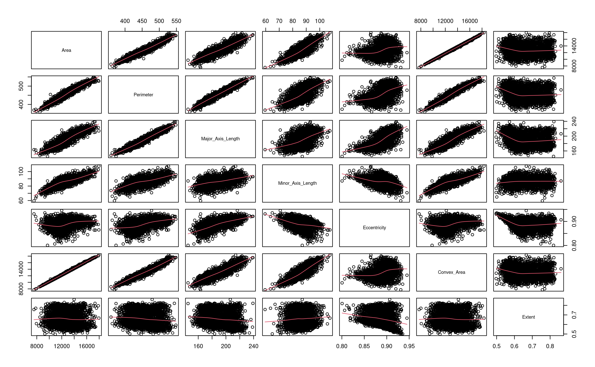
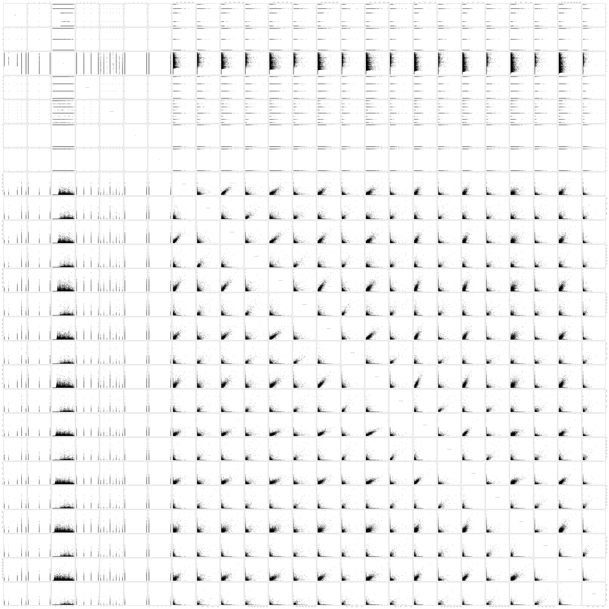

# Data Mining Course - University of Padua Master's CS

Analysis and model fitting of two datasets:
- [Rice challenge](https://www.datachallenge.it/competitions/224)
- [Phone users challenge](https://www.datachallenge.it/competitions/158)

Objective:
- Rice: predict rice variety, target categorical
- Phone: predict monthly call time, target numerical

A full pdf report can be seen at: 

## Scatter Plots

### Rice Varieties 

### Phone Users

