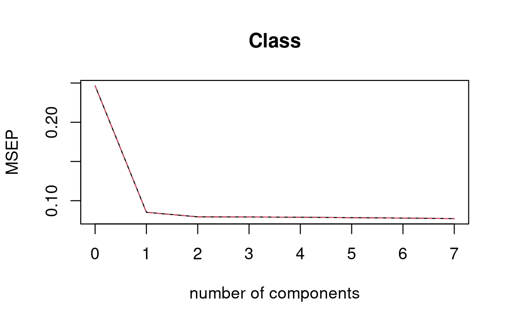

# Preliminary Observations

## Datasets

All following considerations are made using the datasets provided on the challenge page (*rice_test.csv* and *rice_train.csv*), but it is worth noting that a more complete version of them can be found at the [datasets source page](https://www.muratkoklu.com/datasets/). I used it to compute an alternative version of the *test* dataset that contains the true attribute for *Class*.

```{python}
df1 = pd.read_csv("rice_test.csv").round(10)
df2 = pd.read_csv("Rice_Cammeo_Osmancik.csv").round(10)

keys = [col for col in df1.columns]
merged = df1.merge(df2, on=keys, how="inner")
```

## ScatterPlot


From the *scatterplot* we can infer that there are four features (Area, Perimeter, Convex_Area and Major_Axis_Length) that seems to share similar characteristics to the point of being almost linear between each other. For example, given the Area, a linear regression would predict with great precision both Perimeter and Convex_Area.

## Correlation Matrix

We can use a correlation matrix to see exactly how related to each other the features are.

```{r}
cor(rice_train)
```

```{bash}
                         Area  Perimeter Major_Axis_Length Minor_Axis_Length Eccentricity Convex_Area      Extent
Area               1.00000000  0.9670401         0.9035632        0.79022701    0.3465318  0.99895272 -0.06002223
Perimeter          0.96704011  1.0000000         0.9716318        0.63486482    0.5378465  0.97046788 -0.12718015
Major_Axis_Length  0.90356325  0.9716318         1.0000000        0.45675159    0.7062566  0.90390912 -0.13562592
Minor_Axis_Length  0.79022701  0.6348648         0.4567516        1.00000000   -0.2939393  0.78975480  0.06192558
Eccentricity       0.34653177  0.5378465         0.7062566       -0.29393931    1.0000000  0.34707340 -0.19301157
Convex_Area        0.99895272  0.9704679         0.9039091        0.78975480    0.3470734  1.00000000 -0.06397213
Extent            -0.06002223 -0.1271802        -0.1356259        0.06192558   -0.1930116 -0.06397213  1.00000000
```

As suspected, all four features mentioned above have a degree of correlation that exceeds ninety percent. This would mean that, especially for linear models, we would like to combine or remove them, since they can negatively impact regression performances.

## Features Contribution

If we only had the above mentioned four features, then a linear regression would probably be enough to classify rice grains. Let's now try to see how much the remaining three features contribute on the explained variance.

### Linear Regression Coefficients

```{r}
fit = lm(Class ~ ., data=rice_train)

summary(fit)
```

```{bash}
Coefficients:
                    Estimate Std. Error t value Pr(>|t|)    
(Intercept)       -2.152e+00  1.990e+00  -1.081 0.279633    
Area               5.601e-04  1.023e-04   5.474 4.79e-08 ***
Perimeter          8.440e-03  2.221e-03   3.800 0.000148 ***
Major_Axis_Length -2.198e-02  5.709e-03  -3.851 0.000120 ***
Minor_Axis_Length  4.669e-02  1.213e-02   3.850 0.000121 ***
Eccentricity       4.534e+00  1.828e+00   2.481 0.013170 *  
Convex_Area       -8.609e-04  9.418e-05  -9.141  < 2e-16 ***
Extent             7.146e-02  7.144e-02   1.000 0.317237 
```

The significance stars tells us that, with the exception fo Minor_Axis_Length, the features that are highly correlated to each other contributes strongly to the model, while the Eccentricity and Extent contribute very little. This align with our predictions.

We can also measure the total variance explained by all predictors combined using $R^2$.

```{r}
summary(fit)$r.squared    # [1] 0.6953849
```

### Standardized Linear Regression Coefficients

All components are centered around zero, with variance equal to one.

```{r}
library(lm.beta)
lm.beta(fit)
```

```{bash}
Standardized Coefficients::
      (Intercept)              Area         Perimeter Major_Axis_Length Minor_Axis_Length      Eccentricity 
               NA        1.95970669        0.60605955       -0.77272038        0.54256082        0.18931314 
      Convex_Area            Extent 
      -3.09099064        0.01114328 
```

Once again, we can see that Extent and Eccentricity contribute very little to the overall model.

## Principal Components

A good way to aggregate and simplify data is by decomposing it into its principal components (centered in zero and scaled to have unit variance).

```{r}
pc <- prcomp(rice_train, scale. = TRUE)
```

```{bash}
Importance of components:
                          PC1    PC2    PC3     PC4     PC5     PC6     PC7     PC8
Standard deviation     2.2924 1.2436 0.9562 0.51393 0.10621 0.07758 0.04519 0.02052
Proportion of Variance 0.6569 0.1933 0.1143 0.03302 0.00141 0.00075 0.00026 0.00005
Cumulative Proportion  0.6569 0.8502 0.9645 0.99753 0.99894 0.99969 0.99995 1.00000
```

We can see that more than ninety nine percent of overall variance can be explained with just three components, which means that not only we i could make good prediction with lower degree data, but also that a 2D visualization of data that uses only two components should give us a good idea of the whole dataset.


The above graph suggests that the two types of rice are well separated between each other, with similar classes clustering nicely which should lead to low error rates. 

# Prediction

Let us now use the various methods seen in class to predict *yhat* and compute corresponding precision metrics (such as *MSE*).

## Parametric Methods

### Linear Regression

First, we split the data to have a test subset of the training set, then we predict and compute the *MSE*.

```{r}
linear_fit = lm(Class ~ ., data=rice_train, subset = train)

pred <- predict(linear_fit, newdata = rice_train[test, ])
mean((pred - y.test)^2)       # [1] 0.07354557
```

We get our first *MSE* baseline to compare the other methods to, specifically:
- $MSE = 0.07354557$
- $RMSE = 0.2711929$

#### Multicollinearity

Since we know that collinearity can reduce regression precision by increasing the standard error bj which leads to a decline in t-statistic, we can try to combine highly correlated features and see if this translates in a reduction of the *MSE*. Since we know that we have four features that are correlated with each other by more than ninety percent, a straightforward solution would be to simply compute an average for all of them.

```{r}
rice.train$Combined <- rowMeans(rice.train[, c("Area","Perimeter","Major_Axis_Length","Convex_Area")])

linear_fit = lm(Class ~ Minor_Axis_Length+Eccentricity+Extent+Combined, data=rice_train, subset = train)

pred <- predict(linear_fit, newdata = rice_train[test, ])
mean((pred - y.test)^2)     # [1] 0.07439239
```

What we get is a slightly less performant model, since $MSE \approx 0.074$

Another approach is to drop variables altogether, but first we measure their variance inflation factor.

```{bash}
> vif(linear_fit)
             Area         Perimeter Major_Axis_Length Minor_Axis_Length      Eccentricity       Convex_Area            Extent 
      1207.246932        231.583311        362.191786        183.891990         54.613735       1103.660065          1.110601 
```

As a rule of thumb, *VIF* values over ten are considered bad, so now we will iteratively drop values and try to refit the model to see if we can improve the situation.

- **Drop Area:**
  - VIFs = 
    - $Perimeter \approx 114$
    - $Major\_Axis\_Length \approx 206$ 
    - $Minor\_Axis\_Length \approx 133$ 
    - $Eccentricity \approx 53$ 
    - $Convex\_Area \approx 332$ 
    - $Extent \approx 1$
  - $MSE = 0.0735629$
- **Drop Convex_Area:**
  - VIFs = 
    - $Perimeter \approx 108$
    - $Major\_Axis\_Length \approx 134$ 
    - $Minor\_Axis\_Length \approx 40$ 
    - $Eccentricity \approx 49$ 
    - $Extent \approx 1$
  - $MSE = 0.07572877$
- **Drop Major_Axis_Length:**
  - VIFs = 
    - $Perimeter \approx 47$
    - $Minor\_Axis\_Length \approx 37$ 
    - $Eccentricity \approx 29$ 
    - $Extent \approx 1$
  - $MSE = 0.07718435$
- **Drop Perimeter:**
  - VIFs = 
    - $Minor\_Axis\_Length \approx 1$ 
    - $Eccentricity \approx 1$ 
    - $Extent \approx 1$
  - $MSE = 0.0806868$

As we can see, dropping *Area* resulted in performances similar to combining the variables with a simple median, while dropping the other features worsened prediction performances even further.

Lastly, we can use methods that are explicitly robust against multicollinearity, for example ridge or lasso regressions, PCR and PSA and random forest.

### Ridge Regression

First we divide the training set into matrix *x* and vector *y*, then we split the training set to estimate test error.

```{r}
x <- model.matrix(Class ~ ., data=rice_train)[, -1]  
y <- rice_train$Class 

set.seed(1) # for reproducibility
train <- sample(1:nrow(x), nrow(x) / 2)
test <- (-train)
y.test <- y[test]
```

We use the *glmnet* library, which takes care of the variable standardization for us, and allow us to use the built-in cross-validation function for ridge regression to compute the best possible $\lambda$. We then calculate *MSE* and *RMSE*.

```{r}
library(glmnet)
cv.out <- cv.glmnet(x[train, ], y[train], alpha = 0)
plot(cv.out)
bestlam <- cv.out$lambda.min
cv_mse <- min(cv.out$cvm)     # [1] 0.07924703
cv_rmse <- sqrt(cv_mse)       # [1] 0.2815085
```

We actually get a worse result compared to a simple linear regression, since $RMSE \approx 0.28$.

Lastly, we fit the model on the whole dataset and predict classes with *bestlam*.

```{r}
out <- glmnet(x, y, alpha = 0)
x_test <- model.matrix(~ ., data=rice_test)[, -1]  
yhat <- (predict(out, newx=x_test, s = bestlam)>1.5)+1
```

#### Ridge Plot


We can see an effective shrinkage of most coefficients towards zero, with the exception of Eccentricity, which we already recognized as not very impactful on the overall variance and prediction.

### Lasso

Procedure its very similar to ridge, except gimlet gets called with *alpha = 1*.

```{r}
lasso_fit <- glmnet(x, y, alpha = 1)
```

Some metrics:
- $MSE = 0.07348723$
- $RMSE = 0.2786708$

We can see a slight improvement over ridge and linear regression.

#### Lasso Plot


Once again Eccentricity seems to resist shrinkage, but overall we can see a greater degree of coefficient reduction compared to ridge regression (as it should). 

### Principal Components Regression

We once again split the data to fit and validate the model with cross validation.

```{r}
pcr.fit <- pcr(Class ~ ., data = rice_train, subset = train, scale = TRUE, validation = "CV")
validationplot(pcr.fit, val.type = "MSEP")
```


Now we find that the lowest cross-validation error occurs when $M=7$ components are used, but it is almost identical with $M=2$ components.

We compute both test MSE (for two and six components respectively) as follows.

```{r}
pcr.pred <- predict(pcr.fit, x[test, ], ncomp = 2)
mean((pcr.pred - y.test)^2)   # [1] 0.07795264

pcr.pred <- predict(pcr.fit, x[test, ], ncomp = 7)
mean((pcr.pred - y.test)^2)   # [1] 0.07354557
```

Which means that, with seven principal components, PCR obtains:
- $MSE = 0.07416117$
- $RMSE = 0.2711929$

Improving ever so slightly over lasso regression.

Finally, we train the model on the whole data and use it to predict *yhat*.

```{r}
pcr.fit <- pcr(Class ~ ., data = rice_train, scale = TRUE, ncomp = 6)
yhat <- (predict(pcr.fit, newdata=rice_test, ncomp = 6)>1.5)+1
```

### Partial Least Squares



Now it would seem that the lowest cross-validation error with just $M=2$ components.

```{r}
pls.pred <- predict(pls.fit, x[test, ], ncomp = 2)
mean((pls.pred - y.test)^2)   # [1] 0.07609556
``` 

Which means that, with just two principal components, PLS obtains:
- $MSE = 0.07609556$
- $RMSE = 0.2758542$

Slightly worse than PCR, but needs far less components, leading to reduced overfitting and better numerical stability. 

## Nonparametric Regression Techniques

We tried to use only methods that support multivariate data

### LOESS

Loess allows up to four predictors, so we will put only the most useful ones that we previously identified: *Area, Perimeter, Convex_Area* and *Major_Axis_Length*. Predictors are normalized by default.

We split the data like before, to have a subset to calculate *MSE*, and we try to fit three models with three different values of *span*. Then we calculate the *MSE* for each. We must sanitize the prediction since there can be some test points that falls outside the local neighborhood (i.e., *NA*, with $span = 0.1$ we have five such predictions)

```{r}
loess_fit1 <- loess(Class ~ Area + Perimeter + Convex_Area + Major_Axis_Length, data = rice_train, subset = train, span = 0.1)

pred1 <- predict(loess_fit1, newdata = rice_train[test, ])
mean((pred1 - y.test)^2, na.rm = TRUE)    # [1] 46.0226
```

The results follow:
- $span = 0.1$ : $MSE = 46.0226$
- $span = 0.5$ : $MSE = 1.799422$
- $span = 0.9$ : $MSE = 0.2276324$

Results are certainly not exceptional, showing great instability. We thus reduced the number of predictors and immediately got better results.

```{r}
loess_fit1.1 <- loess(Class ~ Area + Perimeter, data = rice_train, subset = train, span = 0.1)

pred1.1 <- predict(loess_fit1.1, newdata = rice_train[test, ])
mean((pred1.1 - y.test)^2, na.rm = TRUE)
```

With only two predictors the results follow:
- $span = 0.1$ : $MSE = 0.06099749$
- $span = 0.5$ : $MSE = 0.06514592$
- $span = 0.9$ : $MSE = 0.06836381$

We can see that, with all span values, we get the best *MSE* values yet, even with high levels of smoothing, which greatly reduce the risk of overfitting.

All that's left predict *yhat*. Since we already use a low number of predictors, it is likely fine to use a small *span* value.

```{r}
yhat <- (predict(loess_fit1.1, newdata=rice_test, span = 0.1)>1.5)+1
```

One last addendum: reducing the model to *Class ~ Area* yielded worse results.

### KNN

Considering the form of our dataset, one would argue that KNN should be the preferred method for classification.

We used the [caret](https://topepo.github.io/caret/) package to handle KNN classification, using Leave-One-Out-Cross-Validation as validation method.

#### Regression

Since up to this point we always used $MSE$ as performance metric, if we want to be consistent we need to train the model in the same way. We can let caret take care of everything and see the results.

```{r}
  train$Class <- as.factor(train$Class) # necessary, caret will automatically do classification 

  knn_fit <- train(
    Class~ .,
    method     = "knn",
    tuneGrid   = expand.grid(k = 1:20),
    trControl  = train.control,
    preProcess = c("center","scale"),    # normalized
    metric     = "Accuracy",
    data       = train)
```

```{bash}
k-Nearest Neighbors 

2810 samples
   7 predictor

Pre-processing: centered (7), scaled (7) 
Resampling: Leave-One-Out Cross-Validation 
Summary of sample sizes: 2809, 2809, 2809, 2809, 2809, 2809, ... 
Resampling results across tuning parameters:

  k   RMSE       Rsquared   MAE      
   1  0.3379865  0.5872696  0.1142349
   2  0.2879551  0.6756952  0.1092527
      .........  .........  .........
  19  0.2385038  0.7672863  0.1123207
  20  0.2386848  0.7669258  0.1126385

RMSE was used to select the optimal model using the smallest value.
The final value used for the model was k = 19.
```


We can see that the error drops considerably between one and five neighbors, and keeps decreasing until $k = 19$. The $R^2$ is also quite good, since the model explain more than seventy percent of the variance in target variable.

To summarize, with $k = 19$:
- $MSE = 0.05688406$
- $RMSE = 0.2385038$

Which is an improvement over LOESS with $span = 0.1$ (therefore it is the best result yet). We pay this precision with a considerable increase in computational demand: LOESS fitting was done in a matter of milliseconds, while KNN required almost five minutes.

Lastly, we just need to predict *yhat* as usual. The optimal *k* is selected automatically.

```{r}
yhat <- (predict(knn_fit, newdata=rice_test)>1.5)+1
```

#### Classification

First wee must transform $Class$ attribute into a factor, then we can train the model. Then we can let caret take care of everything else.

```{r}
  rice_train$Class <- as.factor(rice_train$Class) # necessary, caret will automatically do classification 

  knn_fit <- train(
    Class~ .,
    method     = "knn",
    tuneGrid   = expand.grid(k = 1:20),
    trControl  = train.control,
    preProcess = c("center","scale"),    # normalized
    metric     = "Accuracy",
    data       = rice_train)
```

```{bash}
k-Nearest Neighbors 

2810 samples
   7 predictor
   2 classes: '1', '2' 

Pre-processing: centered (7), scaled (7) 
Resampling: Leave-One-Out Cross-Validation 
Summary of sample sizes: 2809, 2809, 2809, 2809, 2809, 2809, ... 
Resampling results across tuning parameters:

  k   Accuracy   Kappa    
   1  0.8857651  0.7663350
   2  0.8943060  0.7835226
      .........  .........
  19  0.9277580  0.8521018
  20  0.9281139  0.8529105

Accuracy was used to select the optimal model using the largest value.
The final value used for the model was k = 20.
```


The model is most accurate with $k = 20$, similarly to $k = 19$ that we got from KNN-Regression. Now we can predict *yhat* directly without manipulation since this model has been trained as classification from the start.

```{r}
yhat <- predict(knn_fit, newdata=rice_test)
```


### Random Forest

Since this method is the most resource intensive by far, I had to leverage R's multiprocessing capabilities using *doParallel* library. I also used the *ranger* method which is a separate R package that provides a faster and more efficient implementation for the random forest algorithm. 

```{r}
library(doParallel)
cl <- makePSOCKcluster(detectCores() - 1)       # use all available cores except one
registerDoParallel(cl)

# Your train call will now run in parallel
model_fit <- train(..., allowParallel = TRUE)

# Stop the cluster when done
stopCluster(cl)
``` 

I decided to try to reduce the total amount of features by computing an average for the four most correlated ones, much like I did with linear regression at the begging of this report (we already saw that dropping them yield similar to worse results). Then I trained the model once again with LOOCV on the merged features in parallel. 

```{r}
rice.train$Combined <- rowMeans(rice.train[, c("Area","Perimeter","Major_Axis_Length","Convex_Area")])
rice.test$Combined <- rowMeans(rice.test[, c("Area","Perimeter","Major_Axis_Length","Convex_Area")])

train.control <- trainControl(method  = "LOOCV")

rf_fit <- train(
  Class~ Minor_Axis_Length + Eccentricity + Extent + Combined,
  method     = "ranger",
  tuneLength = 10,
  trControl  = train.control,
  metric     = "RMSE",
  data       = rice_train,
  allowParallel = TRUE
)
```

```{bash}
Random Forest 

2810 samples
   4 predictor

No pre-processing
Resampling: Leave-One-Out Cross-Validation 
Summary of sample sizes: 2809, 2809, 2809, 2809, 2809, 2809, ... 
Resampling results across tuning parameters:

  mtry  splitrule   RMSE       Rsquared   MAE      
  2     variance    0.2482647  0.7482916  0.1139348
  2     extratrees  0.2427750  0.7588554  0.1174338
  3     variance    0.2492458  0.7464555  0.1134565
  3     extratrees  0.2449248  0.7546129  0.1171018
  4     variance    0.2508092  0.7435067  0.1129694
  4     extratrees  0.2460461  0.7523921  0.1173860

Tuning parameter 'min.node.size' was held constant at a value of 5
RMSE was used to select the optimal model using the smallest value.
The final values used for the model were mtry = 2, splitrule = extratrees and min.node.size = 5.
```


In the optimal configuration yield the following results:
- $MSE = 0.0589397$
- $RMSE = 0.2427750$

This result is slightly worse than KNN (trained on all features), and it comes at a significant computational cost: it required a 10-Cores machine (i7-13620H (16) @ 4.90 GHz) twenty-five minutes to fit the model (five times more than KNN). It's also worth noting that KNN was fitted without leveraging R's cluster parallelization.

Since the model is trained for regression, to predict *yaht* we just need to proceed as usual (best model configuration is automatically selected).

```{r}
yhat <- (predict(rf_fit, newdata=rice_test)>1.5)+1
```

As for KNN, it is possible to train the model for classification. We just have to convert the target *Class* into a factor, and call the *train* function with *metric = "Accuracy"*.

## Conclusions

The best model so far is KNN with $K = [19,20]$. While slightly more computationally expensive than other methods (with the exception of random forest) it improves MSE by $0.00411343$ over the second best method (LOESS with $span = 0.1$). I decided to use the *yhat* predicted by the model in classification mode, since I felt it was more logically sound.

I decided to not try random forest with all predictors for time constraints.
