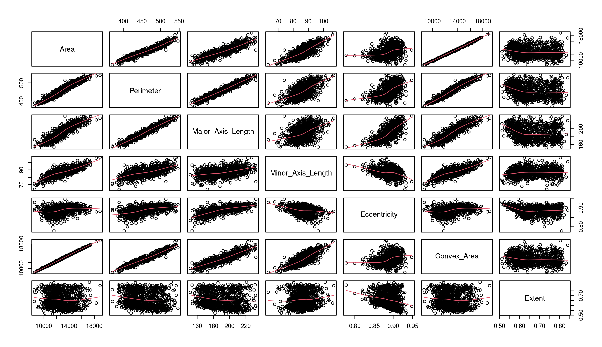
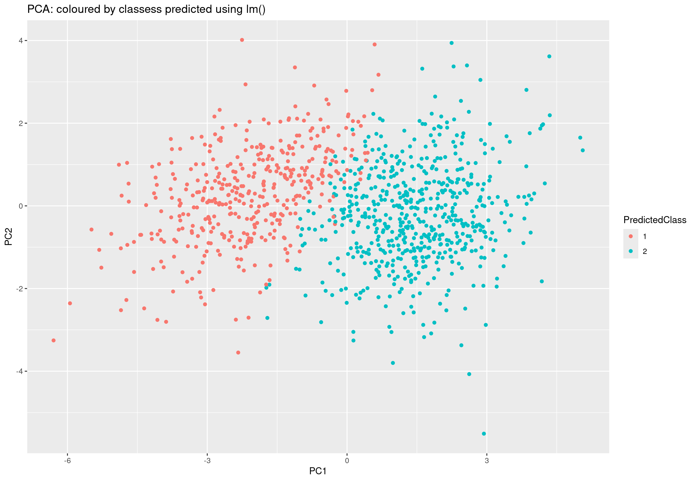

# Preliminary Observations

## Datasets

All following considerations are made using the datasets provided on the challenge page (*rice_test.csv* and *rice_train.csv*), but it is worth noting that a more complete version of them can be found at the [datasets source page](https://www.muratkoklu.com/datasets/). I used it to compute an alternative version of the *test* dataset that contains the true attribute for *Class*.

```{python}
df1 = pd.read_csv("rice_test.csv").round(10)
df2 = pd.read_csv("Rice_Cammeo_Osmancik.csv").round(10)

keys = [col for col in df1.columns]
merged = df1.merge(df2, on=keys, how="inner")
```

## ScatterPlot



From the *scatterplot* we can infer that there are four features (Area, Perimeter, Convex_Area and Major_Axis_Lenght) that seems to share similar characteristics to the point of being almost linear between each other. For example, given the Area, a linear regression would predict with great precision both Perimeter and Convex_Area.

## Correlation Matrix

We can use a correlation matrix to see exactly how related to each other the features are.

```{r}
cor(test)
```

```{bash}
                         Area  Perimeter Major_Axis_Length Minor_Axis_Length Eccentricity Convex_Area      Extent
Area               1.00000000  0.9648441         0.9015284         0.7810733    0.3675062   0.9989030 -0.06433114
Perimeter          0.96484406  1.0000000         0.9725828         0.6156633    0.5630967   0.9684781 -0.14121985
Major_Axis_Length  0.90152836  0.9725828         1.0000000         0.4390172    0.7236148   0.9019506 -0.15033884
Minor_Axis_Length  0.78107334  0.6156633         0.4390172         1.0000000   -0.2855540   0.7804015  0.06755560
Eccentricity       0.36750616  0.5630967         0.7236148        -0.2855540    1.0000000   0.3683452 -0.21374012
Convex_Area        0.99890295  0.9684781         0.9019506         0.7804015    0.3683452   1.0000000 -0.07090790
Extent            -0.06433114 -0.1412199        -0.1503388         0.0675556   -0.2137401  -0.0709079  1.00000000
```

As suspected, all four features mentioned above have a degree of correlation that exceeds ninety percent.

## Features Contribution

If we only had the above mentioned four features, then a linear regression would probably be enough to classify rice grains. Let's now try to see how much the remaining three features contribute on the explained variance.

### Linear Regression Coefficients

```{r}
fit = lm(Class ~ ., data=train)

summary(fit)
```

```{bash}
Coefficients:
                    Estimate Std. Error t value Pr(>|t|)    
(Intercept)       -2.152e+00  1.990e+00  -1.081 0.279633    
Area               5.601e-04  1.023e-04   5.474 4.79e-08 ***
Perimeter          8.440e-03  2.221e-03   3.800 0.000148 ***
Major_Axis_Length -2.198e-02  5.709e-03  -3.851 0.000120 ***
Minor_Axis_Length  4.669e-02  1.213e-02   3.850 0.000121 ***
Eccentricity       4.534e+00  1.828e+00   2.481 0.013170 *  
Convex_Area       -8.609e-04  9.418e-05  -9.141  < 2e-16 ***
Extent             7.146e-02  7.144e-02   1.000 0.317237 
```

The significance starts tells us that, with the exception fo Minor_Axis_Lenght, the features that are highly correlated to each other contributes strongly to the model, while the Eccentricity and Extent contribute very little. This align with our prediticions.

We can also measure the total variance explained by all predictors combined using $R^2$.

```{r}
summary(fit)$r.squared    # [1] 0.6953849
```

### Standardized Linear Regression Coefficients

All components are centered around zero, with variance equal to one.

```{r}
library(lm.beta)
lm.beta(fit)
```

```{bash}
Standardized Coefficients::
      (Intercept)              Area         Perimeter Major_Axis_Length Minor_Axis_Length      Eccentricity 
               NA        1.95970669        0.60605955       -0.77272038        0.54256082        0.18931314 
      Convex_Area            Extent 
      -3.09099064        0.01114328 
```

Once again, we can see that Extent and Eccentricity contribute very little to the overall model.

## Principal Components

A good way to aggregate and simplify data is by decomposing it into its principal components (centered in zero and scaled to have unit variance).

```{r}
pc <- prcomp(test, scale. = TRUE)
```

```{bash}
Importance of components:
                          PC1    PC2    PC3     PC4     PC5     PC6     PC7
Standard deviation     2.1403 1.2281 0.9428 0.11449 0.08022 0.04463 0.02086
Proportion of Variance 0.6544 0.2155 0.1270 0.00187 0.00092 0.00028 0.00006
Cumulative Proportion  0.6544 0.8699 0.9969 0.99873 0.99965 0.99994 1.00000
```

We can see that more than ninenty nine percent of overall variance can be explained with just three components, which means that not only we i could make good prediction with lower degree data, but also that a 2D visualization of data that uses only two components should give us a good idea of the whole dataset.



The above graph suggests that the two types of rice are well separated between each other, with similar classes clustering nicely which should lead to low error rates. Of course, we coloured predicted values, not true labels.

### On Cheated Train Dataset

Just out of curiosity, let us see the above graph computed on true labels (i.e., on the merged test dataset mentioned in section Dataset).

 Here we can see that this graph is quite similar from the previous one, except for the fact that data points are a bit more spread out. We can conclude that our preliminary assumptions were correct.

# Prediction

Let us now use the various methods seen in class to predict *yhat* and compute corresponding precision metrics (such as *MSE*).

## Parametric Methods

### Linear Regression

Let's first compute *MSE* and *RMSE* on the training set.

```{r}
fit = lm(Class ~ ., data=train)
yhat = (predict(fit, newdata=test)>1.5)+1

mse = mean((train$Class -yhat)^2)   # 0.48
rmse = sqrt(mse)                    # 0.69
```

We can see that, on average, predictions are off by 0.7 units, which is far from ideal. Of course, we should split the training set into training and validation sets to get a more precise evaluation.

Of course the actual prediction is computed on the test set.

### Ridge Regression

First we divide the training set into matrix *x* and vector *y*, then we split the training set to estimate test error.

```{r}
x <- model.matrix(Class ~ ., data=rice_train)[, -1]  
y <- rice_train$Class 

set.seed(1) # for reproducibility
train <- sample(1:nrow(x), nrow(x) / 2)
test <- (-train)
y.test <- y[test]
```

Then, we use the built-in cross-validation function for ridge regression to compute the best possible $\lambda$, and calculate both best *MSE* and *RMSE*.

```{r}
library(glmnet)
cv.out <- cv.glmnet(x[train, ], y[train], alpha = 0)
plot(cv.out)
bestlam <- cv.out$lambda.min
cv_mse <- min(cv.out$cvm)     # [1] 0.07924703
cv_rmse <- sqrt(cv_mse)       # [1] 0.2815085
```

We see a significant improvement compared to linear regression, since $RMSE \approx 0.28$.

Lastly, we fit the model on the whole dataset and predict classes with *bestlam*.

```{r}
out <- glmnet(x, y, alpha = 0)
x_test <- model.matrix(~ ., data=rice_test)[, -1]  
yhat <- (predict(out, newx=x_test, s = bestlam)>1.5)+1
```

#### Ridge Plot


We can see an effective shrinkage of most coefficients towards zero, with the exception of Eccentricity, which we already recognized as not very impactful on the overall variance and prediction.

### Lasso

Procedure its very similar to ridge, except gimlet gets called with *alpha = 1*.

```{r}
lasso_fit <- glmnet(x, y, alpha = 1)
```

Some metrics:
- $MSE = 0.07348723$
- $RMSE = 0.2786708$

We can see a slight improvement over ridge regression.

#### Lasso Plot


Once again Eccentricity seems to resist shrinkage, but overall we can see a greater degree of coefficient reduction compared to ridge regression (as it should). 

### Principal Components Regression

We once again split the data to fit and validate the model with cross validation.

```{r}
pcr.fit <- pcr(Class ~ ., data = rice_train, subset = train, scale = TRUE, validation = "CV")
validationplot(pcr.fit, val.type = "MSEP")
```


Now we find that the lowest cross-validation error occurs when $M=6$ components are used, but it is almost identical with $M=2$ components.

We compute both test MSE (for two and six components respectively) as follows.

```{r}
pcr.pred <- predict(pcr.fit, x[test, ], ncomp = 2)
mean((pcr.pred - y.test)^2)   # [1] 0.07795264

pcr.pred <- predict(pcr.fit, x[test, ], ncomp = 6)
mean((pcr.pred - y.test)^2)   # [1] 0.07416117
```

Which means that, with six principal components, PCR obtains:
- $MSE = 0.07416117$
- $RMSE = 0.2723255$

Improving even more over lasso regression.

Finally, we train the model on the whole data and use it to predict *yhat*.

```{r}
pcr.fit <- pcr(Class ~ ., data = rice_train, scale = TRUE, ncomp = 6)
yhat <- (predict(pcr.fit, newdata=rice_test, ncomp = 6)>1.5)+1
```

### Partial Least Squares


Now it would seem that the lowest cross-validation error with just $M=2$ components.

```{r}
pls.pred <- predict(pls.fit, x[test, ], ncomp = 2)
mean((pls.pred - y.test)^2)   # [1] 0.07609556
``` 

Which means that, with just two principal components, PLS obtains:
- $MSE = 0.07609556$
- $RMSE = 0.2758542$

Slightly worse than PCR, but needs far less components, leading to reduced overfitting and better numerical stability. 

## Nonparametric Regression Techniques

